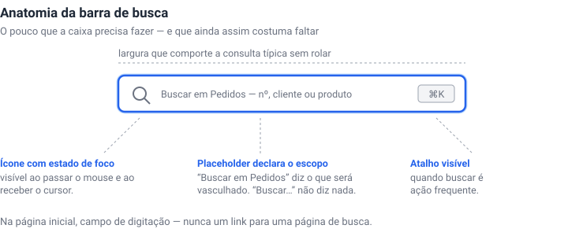
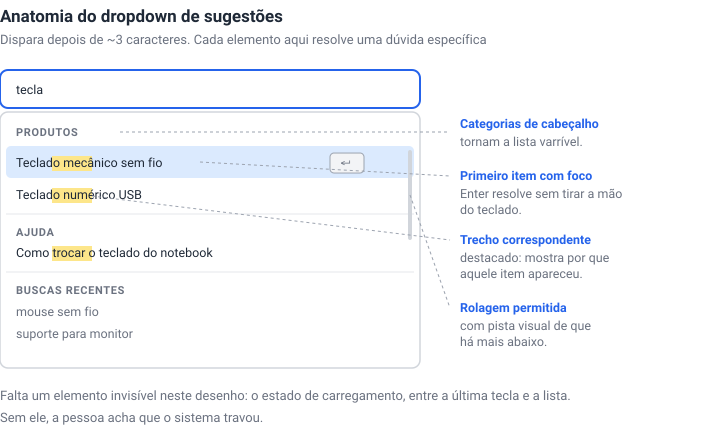
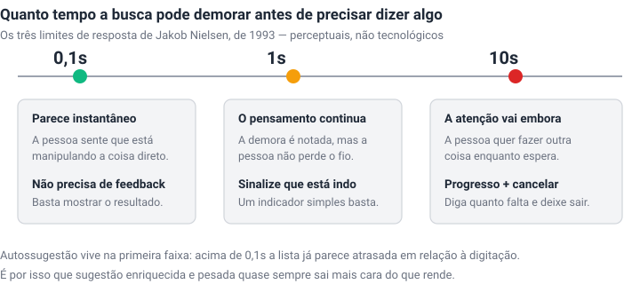
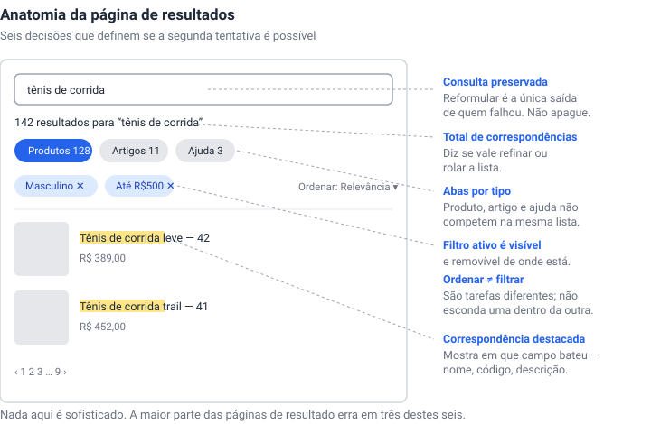
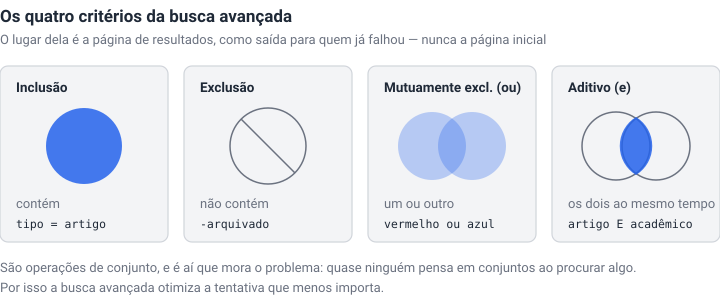

Quase todo projeto de busca começa pela caixa. Onde colocar, que largura ter, que placeholder usar, se o ícone de lupa fica dentro ou fora. São perguntas reais e já respondidas há tempo suficiente para virarem quase folclore: a busca deve ser um campo de digitação e não um link, deve estar no topo, deve caber a consulta típica sem rolar, e deve aparecer em todas as páginas — porque não dá para prever onde a pessoa vai perceber que se perdeu.

O problema é que essas decisões, somadas, respondem por uma fração pequena de por que a busca de um site funciona ou não. O trabalho difícil acontece depois que a pessoa aperta Enter.

## A primeira tentativa é quase toda a chance que existe

O dado mais desconfortável dessa área é também um dos mais antigos. Jakob Nielsen mediu, em 2001, a taxa de sucesso de buscas sucessivas dentro de uma mesma tarefa:

Metade das pessoas acerta de primeira. De quem não acerta, cerca de metade desiste ali mesmo, sem tentar de novo. E quem tenta de novo se sai pior a cada rodada, porque reformular consulta é uma habilidade que quase ninguém tem e que ninguém desenvolve espontaneamente.

Vale dizer com todas as letras que esse número tem 25 anos. Os mecanismos melhoraram muito desde então — correção ortográfica, busca semântica, autossugestão. Mas a assimetria que ele descreve é estrutural, não tecnológica: a primeira consulta carrega quase toda a chance de sucesso, e cada tentativa seguinte vale menos. Isso reordena prioridades de forma bem concreta. Investir em busca avançada, operadores booleanos e filtros sofisticados é otimizar a segunda e a terceira tentativa — o pedaço pequeno. Investir em acertar na primeira é o pedaço grande.

## O pouco que a caixa precisa fazer

Antes de seguir para o que vem depois do Enter, vale fechar a conta do que a barra em si deve resolver. É pouco, e mesmo assim costuma faltar:

O item que mais falta é o **escopo declarado no placeholder**. "Buscar…" não informa nada; "Buscar em Pedidos" diz o que será vasculhado, e essa diferença aparece cedo — a pessoa formula a consulta com base no que acredita estar buscando. Quando a busca cobre um recorte específico (a tabela abaixo, esta pasta, o site inteiro), dizer isso ali evita metade das consultas malformuladas. Em aplicações onde há muitos tipos de dado, Fanny Vassilatos e Ceara Crawshaw sugerem ir além e colocar **exemplos de consulta** no placeholder, porque frequentemente a pessoa nem sabe o que é possível procurar.

Há um detalhe que separa aplicação de site: quando buscar é ação frequente, o atalho de teclado deve estar **visível na própria caixa**, não escondido na documentação.

## Quatro intenções que pedem quatro respostas

Antes de desenhar a página de resultados, vale perguntar o que a pessoa está tentando fazer. A Pencil & Paper separa quatro objetivos que costumam ser tratados como um só:

A terceira é a que quase sempre falta. Existe gente buscando para **confirmar uma ausência** — verificar que aquele registro duplicado não está no sistema, que aquele pedido não foi lançado duas vezes. Para essa pessoa, "nenhum resultado encontrado" não é falha: é a resposta certa, e ela precisa ser dita com confiança suficiente para servir de prova. Interfaces que tratam zero resultados exclusivamente como erro a ser consertado tornam essa tarefa impossível.

A quarta muda o desenho de outro jeito. Quem usa a busca como atalho de navegação — digitar "configurações" em vez de caçar no menu — não quer uma página de resultados. Quer chegar. Uma lista de dez links onde o primeiro é o destino óbvio é uma etapa a mais entre a pessoa e o que ela pediu.

## O dropdown é onde a maioria das buscas termina

Boa parte das consultas nunca chega à página de resultados: resolve-se na lista de sugestões, que costuma disparar por volta do terceiro caractere. É uma superfície pequena com muitas decisões dentro.

Duas coisas valem destaque. A primeira é **destacar o trecho que deu match**: sem isso, a pessoa vê uma lista de itens sem entender por que aqueles e não outros, e não consegue julgar se vale clicar. A segunda é o **foco automático no primeiro resultado**, que transforma a sequência inteira em digitar-e-Enter, sem tirar a mão do teclado — para quem busca muitas vezes por dia, é a diferença entre a ferramenta ser rápida ou apenas parecer moderna.

Vassilatos e Crawshaw são enfáticas quanto ao que mais se esquece aqui: o **estado de carregamento**, entre a última tecla e a lista aparecer. Sem ele, o silêncio é lido como travamento.

### Quanto tempo é tempo demais

Vale ancorar isso em números, porque "rápido" é vago. Os três limites de resposta que Nielsen descreveu em 1993 são perceptuais e não envelheceram:

Autossugestão vive na primeira faixa. Acima de 0,1 segundo a lista já parece atrasada em relação à digitação, e o efeito prático é cruel: a pessoa continua digitando, a lista se rearranja embaixo do cursor, e o clique cai no item errado. É o "argh!" que a Pencil & Paper descreve, e a solução que elas propõem é bem específica — desabilitar certas funções enquanto a pessoa navega com mouse ou teclado, para o alvo parar de se mexer.

Nos casos em que a consulta é genuinamente cara, há uma saída antes de otimizar o motor: deixar a pessoa **escolher um recorte antes de buscar**, em vez de indexar tudo e sofrer a espera em toda consulta.

## O que realmente quebra

A parte mais útil da pesquisa disponível não está nas boas práticas de barra de busca, e sim no levantamento da Baymard sobre **que tipo de consulta os sites não conseguem responder**. Eles avaliam mais de 170 sites de e-commerce, e o padrão que aparece é quase uma acusação:

A busca exata — nome do produto, número do modelo — falha em 12% dos sites. É o caso que todo time testa, porque é o mais fácil de imaginar e o único que aparece na demo. Os casos que quase ninguém testa são os que quebram: perguntar por uma abreviação ("TV 55 pol" contra "televisão 55 polegadas"), procurar o que é compatível com o que já se tem, descrever um sintoma em vez de nomear um produto, ou fazer uma pergunta que não é sobre produto nenhum — política de troca, prazo de entrega, como falar com alguém. Essa última falha em dois terços dos sites.

O que esse gráfico descreve não é uma limitação de tecnologia de busca. É uma limitação de imaginação sobre quem digita. Cada uma dessas falhas corresponde a alguém que formulou a pergunta com as palavras que tinha — e não com as palavras do catálogo.

Há um problema anterior e mais silencioso, que a Pencil & Paper chama de **falta de descoberta**: as pessoas frequentemente não sabem o que existe no sistema. Espera-se que cheguem sabendo o que querem buscar e como formular, quando muitas vezes elas não sabem nem o que é possível procurar ali. Buscas em alta, sugestões pré-definidas e exemplos no placeholder atacam esse problema — não são enfeite, são a única pista sobre o que o índice contém.

## A página de resultados

Um detalhe pequeno e quase sempre errado: **não apague a consulta do campo depois da busca.** Reformular é a única saída de quem falhou, e obrigar a pessoa a redigitar tudo para mudar uma palavra é cobrar um pedágio no pior momento possível.

Dois erros de arrumação aparecem com frequência. O primeiro é **esconder a ordenação dentro da filtragem** — são tarefas diferentes, uma reduz o conjunto e a outra reordena o mesmo conjunto, e agrupá-las obriga a pessoa a procurar uma coisa dentro do lugar da outra. O segundo é **não deixar claro quais filtros estão ativos**, o que produz a experiência clássica de olhar uma lista vazia sem entender que um filtro de três cliques atrás a está estrangulando.

O destaque da correspondência tem uma função que vai além do estético: em sistemas com muitos campos, mostrar **em qual campo** bateu — código de barras, número de lote, nome — é o que permite julgar se aquele resultado interessa.

## Zero resultados é uma página de produto

Como consequência direta, a página de zero resultados merece muito mais atenção do que costuma receber. A Baymard estima que perto de **metade dos sites** não oferece caminho de recuperação quando a busca não retorna nada, e tem um achado específico sobre o que não funciona: **dicas sozinhas não resolvem.** Aquele bloco de conselhos — verifique a ortografia, use termos mais genéricos, tente menos palavras — é raramente lido, e quando é lido não ajuda, porque exige que a pessoa já saiba o que errou. Quem não sabe qual palavra está errada não consegue seguir a instrução de corrigi-la.

O que funciona, na ordem em que a Baymard recomenda:

**Sugerir categorias relacionadas.** Se "jaquetas vermelhas de inverno" não retorna nada, oferecer "jaquetas" — ou melhor, a lista de jaquetas com o filtro de inverno já aplicado.

**Sugerir buscas alternativas, com prévia.** Mostrar três a cinco produtos de cada alternativa, porque depois de uma falha as pessoas hesitam em tentar de novo às cegas. E quando só existe uma alternativa plausível, **aplicá-la automaticamente**, avisando: não havia resultado para o que você digitou, estes são os resultados para o termo corrigido.

**Recomendações personalizadas**, baseadas no que a pessoa já viu. Não vai acertar o item procurado, mas redireciona a atenção em vez de encerrar a visita.

**Contato de suporte visível** — telefone, chat, ajuda. Zero resultados é exatamente o momento em que alguém desiste do site; é barato oferecer uma pessoa antes disso.

**Produtos e categorias populares**, que transformam o beco sem saída em uma vitrine e comunicam a amplitude do catálogo.

## Busca avançada: o lugar certo é depois da falha

A busca avançada é composta de quatro operações: incluir, excluir, alternativa ("ou") e acúmulo ("e"). São operações de conjunto — e aí está o problema, porque quase ninguém pensa em conjuntos ao procurar alguma coisa.

Por isso vale repetir a recomendação de Nielsen, que soa contraintuitiva e tem 25 anos: **não ofereça busca avançada na página inicial.** As pessoas usam errado, e ela ocupa o espaço de algo com mais retorno. O lugar dela é a página de resultados, oferecida a quem já falhou uma vez: "não encontrou? tente a busca avançada".

## Feedback enriquecido: o caso contra

Nem toda melhoria de busca compensa. Kate Kaplan publicou em 2022 um estudo do Nielsen Norman Group sobre sugestões enriquecidas — aquelas caixas de autossugestão com miniaturas de produto, preços, categorias, mais vendidos. O resultado: os participantes usaram esses elementos **7 vezes em 60 oportunidades**, e não passaram a usá-los mais depois de várias buscas no mesmo site. Não é uma questão de aprendizado.

A leitura prática não é "nunca faça", e sim que o investimento raramente se paga e frequentemente atrapalha: sugestões enriquecidas demais, lentas ou instáveis pioram a relação sinal-ruído e são lidas como publicidade. Se for fazer, as diretrizes do estudo são específicas — manter as sugestões de texto simples, que essas sim são muito usadas; limitar conteúdo gráfico pesado, que além de lento induz cegueira de banner; rotular claramente cada tipo de sugestão, porque sem rótulo as pessoas assumem que é conteúdo promocional; e manter cada tipo sempre no mesmo lugar, em vez de rearranjar conforme a consulta.

Note como isso conversa com os limites de resposta: sugestão enriquecida é justamente o tipo de coisa que empurra o dropdown para fora da faixa de 0,1 segundo. Paga-se em latência, no elemento mais sensível a latência de toda a interface, por algo que quase ninguém usa.

## Busca não conserta navegação

Fica por último o erro mais comum de todos, e o mais caro, porque costuma ser uma decisão consciente: usar a busca como remédio para uma arquitetura de informação ruim.

A tentação é compreensível. A navegação está confusa, reorganizá-la é caro e político, e a caixa de busca promete deixar a pessoa achar sozinha o que a estrutura não deixa achar. Mas boa parte das pessoas não usa busca como meio principal de navegação, e — voltando ao começo — quem usa tem uma tentativa boa e só. Apoiar-se na busca para compensar navegação ruim é transferir para o usuário, num canal de baixa taxa de acerto, um problema que era da estrutura. A imagem da Pencil & Paper é boa: busca é tão permanente como solução para problemas de navegação quanto fita adesiva é para uma mangueira de incêndio furada.

A busca é válvula de escape para quem se perdeu. É um ótimo motivo para ela existir em todas as páginas, e um péssimo motivo para deixar as pessoas se perderem.

---

Todas as fontes abaixo foram verificadas em 10 ago 2026.

**Fontes:** [Search: Visible and Simple](https://www.nngroup.com/articles/search-visible-and-simple/) (Jakob Nielsen, NN/g, 2001) · [Response Times: The 3 Important Limits](https://www.nngroup.com/articles/response-times-3-important-limits/) (Jakob Nielsen, NN/g, 1993) · [Search UX Best Practices](https://www.pencilandpaper.io/articles/search-ux) (Fanny Vassilatos e Ceara Crawshaw, Pencil & Paper, 2023) · [Ecommerce Search UX Best Practices](https://baymard.com/blog/ecommerce-search-query-types) (Baymard, atualizado abr 2026) · [5 Proven UX Strategies for "No Results" Pages](https://baymard.com/blog/no-results-page) (Baymard) · [Enriched Site-Search Suggestions: Rarely Used](https://www.nngroup.com/articles/enriched-site-search-suggestions/) (Kate Kaplan, NN/g, 2022) · [Search UX best practices: a complete guide](https://nulab.com/learn/design-and-ux/search-ux-best-practices/) (Nulab)
