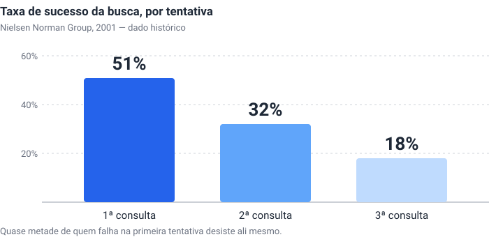
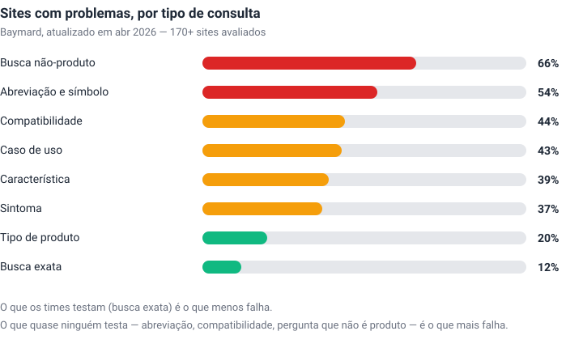
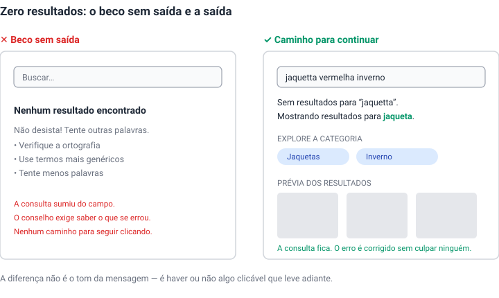

Quase todo projeto de busca começa pela caixa. Onde colocar, que largura ter, que placeholder usar, se o ícone de lupa fica dentro ou fora. São perguntas reais e já respondidas há tempo suficiente para virarem quase folclore: a busca deve ser um campo de digitação e não um link, deve estar no topo, deve caber a consulta típica sem rolar, e deve aparecer em todas as páginas — porque não dá para prever onde a pessoa vai perceber que se perdeu.

O problema é que essas decisões, somadas, respondem por uma fração pequena de por que a busca de um site funciona ou não. O trabalho difícil acontece depois que a pessoa aperta Enter.

## A primeira tentativa é quase toda a chance que existe

O dado mais desconfortável dessa área é também um dos mais antigos. Jakob Nielsen mediu, em 2001, a taxa de sucesso de buscas sucessivas dentro de uma mesma tarefa:

Metade das pessoas acerta de primeira. De quem não acerta, cerca de metade desiste ali mesmo, sem tentar de novo. E quem tenta de novo se sai pior a cada rodada, porque reformular consulta é uma habilidade que quase ninguém tem e que ninguém desenvolve espontaneamente.

Vale dizer com todas as letras que esse número tem 25 anos. Os mecanismos melhoraram muito desde então — correção ortográfica, busca semântica, autossugestão. Mas a assimetria que ele descreve é estrutural, não tecnológica: a primeira consulta carrega quase toda a chance de sucesso, e cada tentativa seguinte vale menos. Isso reordena prioridades de forma bem concreta. Investir em busca avançada, operadores booleanos e filtros sofisticados é otimizar a segunda e a terceira tentativa — o pedaço pequeno. Investir em acertar na primeira é o pedaço grande.

Daí vem uma recomendação que soa contraintuitiva e é antiga: **não ofereça busca avançada na página inicial.** As pessoas usam errado, e ela ocupa o espaço de algo que teria mais retorno. O lugar dela é na página de resultados, como saída para quem já falhou uma vez — "não encontrou? tente a busca avançada".

## Quatro intenções que pedem quatro respostas

Antes de desenhar a página de resultados, vale perguntar o que a pessoa está tentando fazer. Fanny Vassilatos e Ceara Crawshaw, da Pencil & Paper, separam quatro objetivos que costumam ser tratados como um só:

A terceira é a que quase sempre falta. Existe gente buscando para **confirmar uma ausência** — verificar que aquele registro duplicado não está no sistema, que aquele pedido não foi lançado duas vezes. Para essa pessoa, "nenhum resultado encontrado" não é falha: é a resposta certa, e ela precisa ser dita com confiança suficiente para servir de prova. Interfaces que tratam zero resultados exclusivamente como erro a ser consertado tornam essa tarefa impossível.

A quarta muda o desenho de outro jeito. Quem usa a busca como atalho de navegação — digitar "configurações" em vez de caçar no menu — não quer uma página de resultados. Quer chegar. Uma lista de dez links onde o primeiro é o destino óbvio é uma etapa a mais entre a pessoa e o que ela pediu.

## O que realmente quebra

A parte mais útil da pesquisa disponível não está nas boas práticas de barra de busca, e sim no levantamento da Baymard sobre **que tipo de consulta os sites não conseguem responder**. Eles avaliam mais de 170 sites de e-commerce, e o padrão que aparece é quase uma acusação:

A busca exata — nome do produto, número do modelo — falha em 12% dos sites. É o caso que todo time testa, porque é o mais fácil de imaginar e o único que aparece na demo. Os casos que quase ninguém testa são os que quebram: perguntar por uma abreviação ("TV 55 pol" contra "televisão 55 polegadas"), procurar o que é compatível com o que já se tem, descrever um sintoma em vez de nomear um produto, ou fazer uma pergunta que não é sobre produto nenhum — política de troca, prazo de entrega, como falar com alguém. Essa última falha em dois terços dos sites.

O que esse gráfico descreve não é uma limitação de tecnologia de busca. É uma limitação de imaginação sobre quem digita. Cada uma dessas falhas corresponde a alguém que formulou a pergunta com as palavras que tinha — e não com as palavras do catálogo.

## Zero resultados é uma página de produto

Como consequência direta, a página de zero resultados merece muito mais atenção do que costuma receber. A Baymard tem um achado específico sobre ela: **dicas sozinhas não resolvem.** Aquele bloco de conselhos — verifique a ortografia, use termos mais genéricos, tente menos palavras — é frequentemente ignorado, e quando é lido não ajuda, porque exige que a pessoa já saiba o que errou. Quem não sabe qual palavra está errada não consegue seguir a instrução de corrigi-la.

O que funciona é oferecer algo clicável. Sugerir uma categoria relacionada à consulta — se "jaquetas vermelhas de inverno" não retorna nada, oferecer "jaquetas", ou melhor, a lista de jaquetas com o filtro de inverno já aplicado. Mostrar buscas alternativas com **prévia de três a cinco produtos** de cada uma, para a pessoa ver o que existe antes de clicar. E quando só há uma alternativa plausível, aplicá-la automaticamente, avisando: não havia resultado para o que você digitou, estes são os resultados para o termo corrigido.

Há um detalhe pequeno e quase sempre errado: **não apague a consulta do campo depois da busca.** Reformular é a única saída de quem falhou, e obrigar a pessoa a redigitar tudo para mudar uma palavra é cobrar um pedágio no pior momento possível.

## Feedback enriquecido: o caso contra

Nem toda melhoria de busca compensa. Kate Kaplan publicou em 2022 um estudo do Nielsen Norman Group sobre sugestões enriquecidas — aquelas caixas de autossugestão com miniaturas de produto, preços, categorias, mais vendidos. O resultado: os participantes usaram esses elementos **7 vezes em 60 oportunidades**, e não passaram a usá-los mais depois de várias buscas no mesmo site. Não é uma questão de aprendizado.

A leitura prática não é "nunca faça", e sim que o investimento raramente se paga e frequentemente atrapalha: sugestões enriquecidas demais, lentas ou instáveis pioram a relação sinal-ruído e são lidas como publicidade. Se for fazer, as diretrizes do estudo são específicas — manter as sugestões de texto simples, que essas sim são muito usadas; limitar conteúdo gráfico pesado; rotular claramente cada tipo de sugestão, porque sem rótulo as pessoas assumem que é conteúdo promocional; e manter cada tipo sempre no mesmo lugar, em vez de rearranjar conforme a consulta.

## Busca não conserta navegação

Fica por último o erro mais comum de todos, e o mais caro, porque costuma ser uma decisão consciente: usar a busca como remédio para uma arquitetura de informação ruim.

A tentação é compreensível. A navegação está confusa, reorganizá-la é caro e político, e a caixa de busca promete deixar a pessoa achar sozinha o que a estrutura não deixa achar. Mas boa parte das pessoas não usa busca como meio principal de navegação, e — voltando ao começo — quem usa tem uma tentativa boa e só. Apoiar-se na busca para compensar navegação ruim é transferir para o usuário, num canal de baixa taxa de acerto, um problema que era da estrutura.

A busca é válvula de escape para quem se perdeu. É um ótimo motivo para ela existir em todas as páginas, e um péssimo motivo para deixar as pessoas se perderem.

---

## Nota de método

Este texto substitui uma página que era recorte e cola de oito artigos, sem argumento próprio, com trechos traduzidos fora de contexto. A auditoria feita antes de reescrever encontrou o seguinte:

**Um erro de tradução que invertia o sentido.** Havia uma seção intitulada "A Obsolescência da Busca na Internet", afirmando que "a busca está se tornando obsoleta". O original de Nielsen diz *"search is becoming old hat"* — busca virou lugar-comum, banal. O argumento dele é o oposto do que a tradução sugeria: justamente porque a busca é onipresente, seria de esperar que as pessoas desenvolvessem habilidades avançadas, e elas não desenvolvem.

**Dados de 2001 apresentados como atuais.** As taxas de 51%, 32% e 18% são reais, mas de um artigo de 12 de maio de 2001. A anotação original não trazia data nem autor.

**Percentuais desatualizados.** Os oito números da Baymard citados na versão anterior divergem todos da fonte atual, revisada em abril de 2026 — busca exata aparecia como 33% quando hoje é 12%; busca não-produto como 50% quando hoje é 66%. Os números aqui são os atuais.

**Sete imagens hotlinkadas** de CDNs do Medium, da Baymard e do Webflow. Respondiam quando verifiquei, mas são conteúdo de terceiros servido de servidor alheio, que some sem aviso. Substituí por diagramas autorais em SVG.

**Numeração quebrada** — a lista do UX Planet pulava do item 1 para o 3 — e nenhum trecho identificava autor ou data.

Todas as fontes abaixo foram verificadas em 10 ago 2026.

**Fontes:** [Search: Visible and Simple](https://www.nngroup.com/articles/search-visible-and-simple/) (Jakob Nielsen, 2001) · [Search UX Best Practices](https://www.pencilandpaper.io/articles/search-ux) (Vassilatos e Crawshaw, Pencil & Paper, 2023) · [Ecommerce Search UX Best Practices](https://baymard.com/blog/ecommerce-search-query-types) (Baymard, atualizado abr 2026) · [5 Proven UX Strategies for "No Results" Pages](https://baymard.com/blog/no-results-page) (Baymard) · [Enriched Site-Search Suggestions: Rarely Used](https://www.nngroup.com/articles/enriched-site-search-suggestions/) (Kate Kaplan, NN/g, 2022) · [Search UX best practices: a complete guide](https://nulab.com/learn/design-and-ux/search-ux-best-practices/) (Nulab)
