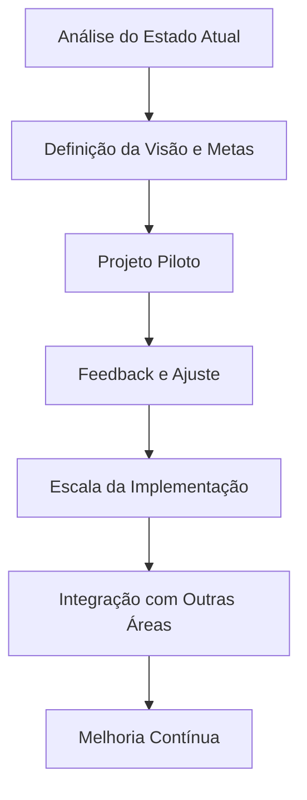
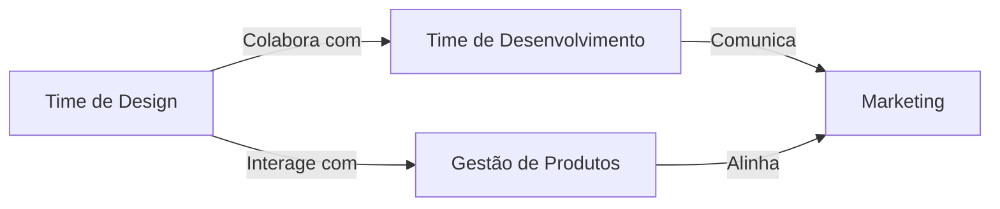

## Índice

1. Introdução
2. Fundamentação Teórica e Contextualização do DesignOps
3. Componentes Essenciais do DesignOps
4. Estratégias para a Implementação de Processos de DesignOps
5. Ferramentas e Plataformas Utilizadas no DesignOps
6. Estudos de Caso e Exemplos Práticos
7. Avaliação de Métricas e Indicadores de Sucesso
8. Desafios e Recomendações para Empresas
9. Conclusão

---

## 1. Introdução

A transformação digital tem impulsionado uma nova abordagem na forma de desenvolver e entregar produtos, e o design passou de uma função criativa isolada para um componente estratégico fundamental nas empresas. Nesse contexto, o DesignOps – ou Design Operations – surge como uma disciplina destinada a otimizar os processos, as ferramentas e a colaboração entre os times de design, integrando práticas oriundas de áreas como Recursos Humanos, Gerenciamento de Projetos, UX/UI Design e Garantia de Qualidade. Este artigo explora a implementação de processos de DesignOps em empresas, com foco na aplicação prática dessas estratégias, na utilização de ferramentas específicas e na mensuração de resultados. A discussão se baseia em materiais robustos, entre os quais destacam-se publicações da Nielsen Norman Group, guias de DesignOps e estudos de caso que evidenciam os benefícios dessa abordagem para organizações que buscam melhorar a eficiência e a consistência de suas entregas.

---

## 2. Fundamentação Teórica e Contextualização do DesignOps

O DesignOps representa uma evolução natural, à medida que os desafios enfrentados pelas equipes de design se intensificam com o crescimento organizacional. Inicialmente, o conceito ganhou forma devido à necessidade de estruturar equipes complexas – assim como há gestores especializados na construção ou no desenvolvimento de softwares, o DesignOps organiza os fluxos e práticas dos times de design para que estes possam focar em sua principal atividade: criar e inovar.

### 2.1. Contexto de Surgimento do DesignOps

Nas últimas décadas, a expansão dos mercados e a crescente complexidade dos produtos digitais impulsionaram a necessidade de intersecções entre design e outras disciplinas, tais como a gestão operacional, o gerenciamento de projetos e a engenharia. Essa interseção levou ao surgimento do DesignOps, que tem como objetivo facilitar a coordenação de processos, estabelecer papéis claros e mensuráveis, além de criar um ambiente colaborativo que impacta diretamente na qualidade dos produtos finais.

### 2.2. Principais Conceitos e Terminologias

Entre os termos frequentemente utilizados, destacam-se:
- **DesignOps como disciplina:** Trata-se da orquestração e otimização das pessoas e processos para maximizar a eficiência do design, visando entregar valor em escala.
- **Três desafios centrais do DesignOps:** Como os desafios de “como trabalhamos juntos”, “como realizamos o trabalho” e “como criamos impacto” evidenciam a necessidade de coordenar times dispersos e fluxos de trabalho complexos.
- **Integração com outras áreas:** O DesignOps não atua de forma isolada, mas em sinergia com áreas como desenvolvimento de produtos, engenharia e marketing para assegurar que o design esteja alinhado com os objetivos estratégicos da empresa.
A compreensão desses fundamentos é crucial para a aplicação prática de processos de DesignOps, pois possibilita a estruturação de fluxos que minimizam retrabalho, evitam inconsistências e promovem a colaboração contínua entre os departamentos.

---

## 3. Componentes Essenciais do DesignOps

A efetividade do DesignOps está diretamente ligada à definição e padronização dos seus componentes. Estes elementos servem de base para a criação de um ambiente operacional robusto, onde os times de design podem trabalhar de forma coesa e eficiente.

### 3.1. Pessoas

O primeiro componente é, sem dúvida, o fator humano. O DesignOps concentra-se na gestão e capacitação de equipes, enfatizando:
- **Definição de papéis e responsabilidades:** Estabelecimento de funções claras, como Design Producers, UX Program Managers e ResearchOps Specialists, que possibilitam a divisão adequada das tarefas e o aumento da produtividade.
- **Cultura de colaboração:** É fundamental que os profissionais compartilhem conhecimento, realizem revisões regulares e se mantenham atualizados com as melhores práticas do mercado.
- **Desenvolvimento e treinamento:** Investir na qualificação dos membros da equipe através de treinamentos, workshops e cursos específicos de DesignOps é determinante para a evolução contínua da equipe.

### 3.2. Processos

Os processos são a espinha dorsal do DesignOps. A padronização das etapas operacionais permite que os times:
- **Estabeleçam fluxos de trabalho claros:** Certificar que cada projeto siga uma sequência definida de etapas, reduzindo erros e aumentando a previsibilidade dos resultados.
- **Utilizem metodologias ágeis e feedback loops:** A implementação de ciclos de feedback regulares garante a melhoria contínua dos processos e a adequação das práticas às necessidades atuais do projeto.
- **Documentem e compartilhem as melhores práticas:** A criação de manuais, diretrizes e design systems padronizados facilita a reprodutibilidade do trabalho e a disseminação do conhecimento dentro da empresa.

### 3.3. Ferramentas e Infraestrutura

A escolha e a implementação de ferramentas adequadas são determinantes para o sucesso do DesignOps:
- **Ferramentas de design:** Softwares como Figma, Adobe XD e InVision possibilitam a criação de protótipos e a visualização rápida de ideias, promovendo a padronização dos componentes visuais.
- **Plataformas de colaboração:** Ferramentas como Slack, Microsoft Teams, Miro e Confluence são essenciais para garantir uma comunicação efetiva entre os membros da equipe e facilitar o acesso às informações necessárias.
- **Sistemas de gerenciamento de projetos:** Aplicativos como Jira, Trello e Asana ajudam a monitorar prazos, organizar tarefas e distribuir a carga de trabalho de maneira transparente e escalável.
Esses componentes – pessoas, processos e ferramentas – constituem os pilares sobre os quais se estrutura o DesignOps, permitindo que as empresas alcancem eficiência operacional e promovam inovações contínuas.

---

## 4. Estratégias para a Implementação de Processos de DesignOps

A implementação eficaz de DesignOps requer uma abordagem estruturada e adaptada às necessidades específicas da organização. Nesta seção, discutiremos as principais estratégias para a implementação prática desta metodologia.

### 4.1. Análise do Estado Atual

Antes de iniciar a implementação, é vital realizar uma análise detalhada da situação atual da empresa, considerando:
- **Diagnóstico dos processos existentes:** Realizar pesquisas internas, como entrevistas com stakeholders, “listening tours” e surveys, para identificar os principais gargalos e pontos de melhoria.
- **Mapeamento dos fluxos de trabalho:** Documentar o fluxo dos processos atuais, identificando as etapas onde ocorrem atrasos ou retrabalhos desnecessários.
- **Avaliação do nível de maturidade do design:** Utilizando modelos como o DoTA (DesignOps Teams Assessment), é possível mensurar o nível de maturidade dos processos e identificar oportunidades de melhoria em dimensões como pessoas, processos e ecossistema.

### 4.2. Definição da Visão e Objetivos

Com a análise do estado atual em mãos, é fundamental definir uma visão clara da implementação dos processos de DesignOps:
- **Estabelecimento de metas estratégicas:** Determinar objetivos específicos, mensuráveis, alcançáveis, relevantes e temporais (SMART) que orientem a transformação dos processos de design.
- **Criação de uma cultura orientada ao DesignOps:** Promover a importância do design como uma função estratégica dentro da organização, incentivando a colaboração entre departamentos e o compromisso com a melhoria contínua.
- **Definição de indicadores e métricas:** Planejar a implementação de KPIs (Key Performance Indicators) para monitorar a performance dos processos, como tempo de conclusão de projetos, satisfação dos usuários e impacto dos designs na conversão dos produtos.

### 4.3. Piloto e Escala

Após definir a visão e os objetivos, a implementação pode ser iniciada com projetos pilotos:
- **Projeto piloto:** Selecionar uma área ou projeto específico para testar as novas abordagens e ajustes propostos. Essa fase piloto deve ser cuidadosa para medir os resultados e ajustar processos conforme necessário.
- **Iteração e refinamento:** Utilizar os feedbacks gerados durante o piloto para aprimorar os processos antes de uma implementação em larga escala. A comunicação aberta e os ciclos de feedback são essenciais para ajustar práticas e ferramentas continuamente.
- **Escalabilidade dos processos:** Após validar o projeto piloto, os processos e ferramentas podem ser progressivamente implementados em outros departamentos e áreas da empresa, garantindo a padronização e a integração dos times de design em toda a organização.

### 4.4. Integração com Outras Áreas da Empresa

Uma implementação bem-sucedida do DesignOps depende da integração estreita entre design e outras áreas, tais como:
- **Desenvolvimento e Engenharia:** Estabelecer processos de handoff e comunicação clara entre designers e desenvolvedores para minimizar mal-entendidos e retrabalhos.
- **Gestão de Produtos:** Alinhar os objetivos estratégicos e as prioridades dos projetos, garantindo que o design esteja em sintonia com as necessidades do negócio.
- **Marketing e Vendas:** Promover uma visão unificada que permita que os insights do design contribuam para estratégias de comunicação e posicionamento de mercado.
A integração entre as áreas fomenta um ambiente colaborativo onde os processos de DesignOps podem se desenvolver de forma orgânica e sustentável, gerando ganhos significativos em eficiência e qualidade geral dos produtos.

---

## 5. Ferramentas e Plataformas Utilizadas no DesignOps

A adoção de ferramentas e plataformas adequadas é um dos principais fatores de sucesso na implementação de DesignOps. Nesta seção, serão exploradas as principais soluções utilizadas, agrupadas em diferentes categorias que atendem às necessidades específicas dos processos de design.

### 5.1. Ferramentas de Design e Prototipagem

O uso de ferramentas específicas para a criação e prototipagem é indispensável:
- **Figma, Adobe XD e Sketch:** Essas ferramentas permitem que os designers desenvolvam interfaces coesas e protótipos altamente interativos, facilitando a colaboração entre os membros da equipe e a aprovação por parte dos stakeholders.
- **InVision:** Além de prototipagem, o InVision também atua como uma plataforma para o gerenciamento de design systems, permitindo que os times compartilhem recursos e mantenham a consistência visual em todos os projetos.

### 5.2. Plataformas de Colaboração e Comunicação

Para fomentar a integração entre os membros da equipe e entre departamentos, as plataformas de comunicação e colaboração são essenciais:
- **Slack e Microsoft Teams:** Essas ferramentas promovem uma comunicação rápida e eficiente, permitindo a troca de mensagens instantâneas, a organização de canais temáticos e a realização de chamadas de vídeo para reuniões e atualizações rápidas.
- **Miro e Mural:** São plataformas que oferecem quadros colaborativos para brainstorming, workshops e sessões de ideação, facilitando a visualização e o compartilhamento de ideias em tempo real.
- **Confluence:** Usado como um repositório central de documentos, o Confluence permite que diretrizes, manuais e design systems sejam facilmente acessíveis e atualizados pelos membros da equipe.

### 5.3. Sistemas de Gerenciamento de Projetos

Ferramentas para o gerenciamento dos fluxos de trabalho e a organização das tarefas garantem que os processos sejam executados de forma organizada e que os prazos sejam cumpridos:
- **Jira e Trello:** Essas plataformas possibilitam a criação de quadros Kanban, a distribuição de tarefas e a acompanhamento dos progressos dos projetos, garantindo transparência e agilidade no ambiente de trabalho.
- **Asana e Monday.com:** Alternativas que também auxiliam no gerenciamento de projetos por meio de cronogramas, listas de tarefas e dashboards customizáveis, permitindo que os gestores acompanhem os indicadores de produtividade e desempenho dos times.

### 5.4. Desenvolvimento e Manutenção de Design Systems

Manter um design system atualizado e alinhado com as melhores práticas é vital para assegurar a consistência e a eficiência do trabalho:
- **Sistemas de gerenciamento de design:** Plataformas como Zeplin e InVision oferecem funcionalidades específicas para a criação e manutenção de bibliotecas de componentes, garantindo que todos os produtos digitais sigam os mesmos padrões visuais e interativos.
- **Documentação e Style Guides:** O desenvolvimento de manuais de uso e guias de estilo permite que todos os envolvidos – desde designers até desenvolvedores – tenham uma referência única e confiável para a execução de suas tarefas.

---

### Tabela Comparativa: Ferramentas e Plataformas no DesignOps

|   |   |   |
|---|---|---|
|Categoria|Ferramentas Principais|Função Principal|
|Ferramentas de Design e Prototipagem|Figma, Adobe XD, Sketch, InVision|Criação de interfaces, prototipagem e gerenciamento de design systems|
|Colaboração e Comunicação|Slack, Microsoft Teams, Miro, Confluence|Comunicação em tempo real, colaboração e documentação compartilhada|
|Gerenciamento de Projetos|Jira, Trello, Asana, Monday.com|Organização de tarefas, acompanhamento de projetos e prazos|
|Manutenção de Design Systems|InVision, Zeplin|Centralização de componentes, padronização e controle de versões|
**Descrição da Tabela:** Esta tabela comparativa ilustra as principais categorias de ferramentas utilizadas no DesignOps, destacando as opções selecionadas e as funções que elas desempenham no apoio à implementação dos processos e na operacionalização das equipes de design.

---

## 6. Estudos de Caso e Exemplos Práticos

Para ilustrar a aplicação prática dos processos de DesignOps, esta seção apresenta estudos de caso e exemplos de empresas que já implementaram essa abordagem com sucesso.

### 6.1. Caso Yara: Uma Implementação Real

No exemplo da empresa Yara, o DesignOps foi implementado com o objetivo de melhorar os processos, as ferramentas e a colaboração entre os designers e demais áreas da organização. Desde a sua criação, em novembro de 2021, a equipe de DesignOps atingiu marcos significativos, como:
- **Padronização de descrições de cargos:** A criação de epics e a definição de áreas de foco baseadas nas diretrizes da Nielsen Norman Group (como “Como realizamos o trabalho”, “Como trabalhamos juntos” e “Como nossa entrega gera impacto”).
- **Utilização de ferramentas colaborativas:** Adotaram Jira para gerenciamento de tarefas, Miro para sessões colaborativas e Confluence para centralização de informações e documentação.
- **Comunicação otimizadas:** Utilização de canais como Slack e Microsoft Teams para manter os times conectados e informados, além de métodos inovadores como vídeos explicativos e atualizações temáticas para reduzir a necessidade de reuniões longas.
Este caso ilustra que a implementação do DesignOps não se trata apenas de adotar novas ferramentas, mas de transformar a cultura organizacional para promover uma colaboração real e contínua entre os departamentos.

### 6.2. Avaliação do Nível de Maturidade com o DoTA

Outro exemplo relevante é o uso do modelo de avaliação DoTA (DesignOps Teams Assessment) em equipes que utilizam métodos ágeis, especialmente em instituições financeiras. Esse modelo avalia três dimensões principais:
- **Pessoas:** Focado na organização, na colaboração e no crescimento dos profissionais.
- **Processos:** Voltados à padronização e organização do fluxo de trabalho.
- **Ecossistema:** Abrangendo os recursos, ferramentas e o ambiente que suportam as operações de design.
A aplicação desse modelo indicou que muitas equipes apresentam um nível de maturidade intermediário, evidenciando a necessidade de investir na capacitação dos líderes e na integração dos processos operacionais para alcançar níveis superiores de eficiência.

### 6.3. Exemplos Adicionais da Indústria de Tecnologia

Artigos de fontes como Netguru e Futurice reforçam que a implementação do DesignOps pode transformar significativamente os processos das equipes de design. Algumas práticas recomendadas incluem:
- **Início em pequena escala:** Começar com projetos pilotos e, após a validação do modelo, escalar os processos para outras áreas da organização.
- **Feedback contínuo:** Estabelecer ciclos de retroalimentação com indicadores bem definidos, de modo a assegurar a melhoria contínua dos processos e a adaptação aos desafios do ambiente empresarial.
- **Integração interdepartamental:** Garantir que os times de design, desenvolvimento e produto compartilhem uma visão comum e trabalhem de forma integrada para que os produtos finais sejam consistentes e de alta qualidade.

---

### Diagrama de Fluxo: Implementação Gradual do DesignOps

**Descrição do Diagrama:** O diagrama acima ilustra um fluxo ideal para a implementação do DesignOps em empresas, detalhando os passos desde a análise do estado atual até a escalabilidade e integração interdepartamental, evidenciando a importância do feedback contínuo para ajustes e aprimoramentos.

---

## 7. Avaliação de Métricas e Indicadores de Sucesso

Uma das vantagens mais evidentes do DesignOps é a possibilidade de mensurar os resultados das operações de design. As métricas permitem não só avaliar a eficiência dos processos, mas também demonstrar o impacto direto do design no desempenho global da empresa.

### 7.1. Principais Indicadores de Desempenho (KPIs)

A implantação de um sistema robusto de métricas é essencial para a avaliação dos processos de DesignOps. Alguns dos KPIs comumente utilizados incluem:
- **Tempo de entrega dos projetos:** Mede a eficiência dos fluxos de trabalho e a capacidade de cumprir os prazos estabelecidos, ajudando a identificar gargalos e áreas de atraso.
- **Satisfação dos usuários:** Avaliada por meio de pesquisas e feedbacks que indicam a qualidade dos produtos entregues e a adequação das soluções às necessidades dos usuários finais.
- **Taxa de retrabalho:** Indicador que mostra a quantidade de revisões ou correções realizadas após a entrega inicial, podendo sinalizar falhas na comunicação entre as equipes ou inconsistências no design.
- **Produtividade das Equipes:** Análise qualitativa e quantitativa que considera a quantidade de projetos concluídos, a utilização das ferramentas implementadas e a eficiência na resolução de problemas do dia a dia.

### 7.2. Relacionamento entre Métricas e Sucesso Operacional

A mensuração dos indicadores é fundamental para relacionar os esforços do DesignOps com os resultados alcançados. Através de dashboards e dashboards customizados, as empresas podem realizar análises periódicas e comparar:
- **Antes e depois da implementação:** Comparando os indicadores anteriores e posteriores à adoção dos processos de DesignOps, é possível evidenciar os ganhos em eficiência e qualidade.
- **Indicadores interdepartamentais:** A colaboração entre design, desenvolvimento e produtos pode ser medida por indicadores que refletem a integração dos fluxos de trabalho e a redução dos silos operacionais.

### 7.3. Ferramentas para Monitoramento e Relatórios

A utilização das ferramentas de gerenciamento de projetos, combinadas com plataformas de análise de dados, permite a criação de relatórios detalhados que facilitam a interpretação dos resultados. Por exemplo:
- **Dashboards Integrados:** Ferramentas como Jira e Trello podem ser configuradas para gerar gráficos e tabelas de desempenho, visualizando os principais KPIs e permitindo a tomada de decisão baseada em dados reais.
- **Relatórios de Feedback:** A implementação de ciclos de feedback permite a identificação de pontos de melhoria, possibilitando ajustes nos processos em tempo real.

### Tabela de Indicadores e Métricas de Sucesso em DesignOps

|   |   |   |
|---|---|---|
|Indicador|Descrição|Fonte de Dados|
|Tempo de entrega|Duração média para conclusão de projetos|Relatórios do Jira/Trello|
|Satisfação dos usuários|Avaliação da qualidade dos produtos finais|Pesquisas e feedback dos clientes|
|Taxa de retrabalho|Frequência de revisões após a entrega inicial|Análise de revisões em design systems|
|Produtividade das Equipes|Número de projetos concluídos no período|KPI’s internos e dashboards|
**Descrição da Tabela:** Este quadro apresenta uma visão comparativa dos indicadores-chave para a avaliação dos processos de DesignOps, permitindo que as empresas relacionem seus esforços operacionais com os resultados práticos obtidos, facilitando a identificação de áreas para melhorias contínuas.

---

## 8. Desafios e Recomendações para Empresas

Apesar dos benefícios evidentes, a implementação do DesignOps não está isenta de desafios. Empresas de todos os portes podem enfrentar obstáculos na adoção dessa abordagem inovadora, mas existem estratégias e recomendações que podem mitigar essas dificuldades.

### 8.1. Resistência à Mudança

Um dos desafios mais comuns é a resistência interna à mudança, onde equipes acostumadas a métodos tradicionais podem apresentar dificuldades para adotar novos processos. Para superar tal barreira, é recomendável:
- **Comunicação Clara e Transparente:** Explicar os benefícios do DesignOps e como ele melhorará a produtividade e a qualidade dos projetos, alinhando as expectativas com resultados mensuráveis.
- **Capacitação e Treinamento:** Oferecer cursos e workshops que familiarizem as equipes com as novas ferramentas e metodologias é fundamental para reduzir a resistência e aumentar o engajamento.
- **Implementação Gradual:** Iniciar com projetos pilotos permite que os times se adaptem aos novos processos sem a necessidade de uma mudança abrupta em toda a empresa.

### 8.2. Restrições de Recursos

Limitações orçamentárias, mão de obra qualificada insuficiente e a necessidade de investir em novas tecnologias podem dificultar a adoção do DesignOps. Para enfrentar esse desafio, as empresas podem:
- **Priorizar Investimentos:** Focar em áreas com maior potencial de retorno e melhorar primeiro os processos que geram maior impacto.
- **Fasear a Implementação:** Adotar uma abordagem escalonada, iniciando pelos processos críticos e expandindo gradualmente as iniciativas para cobrir outras áreas da empresa.
- **Buscar Parcerias Estratégicas:** Colaborar com consultorias especializadas ou fornecedores de tecnologia pode oferecer suporte técnico e operacional necessário para a transição.

### 8.3. Integração com Departamentos Silenciados

A falta de integração entre os departamentos, sobretudo entre design, desenvolvimento e gerenciamento de produtos, pode comprometer a eficácia do DesignOps. Soluções para essa questão incluem:
- **Criação de Times Multifuncionais:** Estabelecer equipes compostas por membros de diferentes áreas promove a troca de conhecimentos e a fomento de uma cultura colaborativa.
- **Estabelecimento de Processos de Handoff Eficientes:** Desenvolver os processos de transição entre design e desenvolvimento, definindo claramente as responsabilidades de cada etapa, minimizando assim falhas de comunicação e retrabalhos.
- **Reuniões de Alinhamento Regulares:** Organizar reuniões interdepartamentais com o objetivo de revisar objetivos, mútuas dependências e alinhar estratégias, garantindo que todos os envolvidos estejam informados sobre as prioridades e desafios do projeto.

### 8.4. Recomendações Gerais para uma Implementação Bem-Sucedida

Com base nos estudos e práticas analisadas, as recomendações para as empresas que pretendem implementar o DesignOps são:
- **Realizar um Diagnóstico Completo:** Antes de qualquer mudança, mapeie os processos atuais e identifique pontos críticos.
- **Definir Claramente a Visão e os Objetivos:** A estratégia deve ser alinhada à cultura e aos desafios específicos da organização.
- **Investir em Capacitação e Ferramentas Adequadas:** A adoção de novas tecnologias deve vir acompanhada de treinamento e suporte contínuo para os times.
- **Implementar Projetos Pilotos:** Teste a nova abordagem em áreas específicas antes de expandir para toda a empresa.
- **Promover a Colaboração e a Integração Interdepartamental:** Crie canais permanentes de comunicação e ajuste os processos para reduzir silos operacionais.
- **Estabelecer Indicadores de Sucesso:** Monitorar e avaliar constantemente os resultados através de KPIs para garantir a melhoria contínua dos processos.

---

## 9. Conclusão

A implementação de processos de DesignOps em empresas representa uma evolução fundamental para as organizações que desejam maximizar o impacto do design em seus produtos e serviços. Ao integrar pessoas, processos e ferramentas de maneira estruturada, é possível criar um ambiente mais colaborativo, reduzir erros e aumentar a eficiência operacional.
**Principais descobertas e recomendações:**
- **Integração de Pessoas, Processos e Ferramentas:** O sucesso do DesignOps está atrelado à correta estruturação desses três componentes, permitindo que os times de design se concentrem na inovação e na criação de valor.
- **Análise do Estado Atual e Planejamento Estratégico:** Realizar um diagnóstico completo e definir metas claras são passos essenciais para a transição de métodos tradicionais para uma abordagem orientada ao DesignOps.
- **Investimento em Capacitação e Ferramentas Adequadas:** A adoção de plataformas colaborativas, sistemas de gerenciamento de projetos e design systems padronizados potencializa a eficiência e a consistência das entregas.
- **Importância do Feedback e da Iteração Contínua:** Estabelecer ciclos de revisão e incorporar feedbacks regulares possibilita a melhoria contínua dos processos e ajusta os fluxos para responder de forma rápida às demandas do mercado.
- **Desafios e Recomendações para uma Implementação Sustentável:** Superar a resistência à mudança, adequar os recursos disponíveis e promover a integração entre departamentos são desafios que podem ser mitigados por meio de estratégias bem definidas e comunicação efetiva.

### Lista Resumida dos Principais Pontos

- Diagnóstico prévio e mapeamento dos fluxos atuais.
- Definição clara de papéis, responsabilidades e metas.
- Implantação gradual com projetos pilotos e escalabilidade.
- Uso intensivo de ferramentas colaborativas (Figma, Slack, Jira, etc.).
- Monitoramento dos resultados através de indicadores e KPIs.
- Fomento à integração interdepartamental para reduzir silos.
- Investimento contínuo em treinamento e capacitação dos times.
A implementação do DesignOps não é apenas uma tendência, mas uma necessidade para empresas que desejam se manter competitivas num cenário cada vez mais digital e colaborativo. Ao adotar essa abordagem, as organizações podem transformar seus processos de design, melhorar a qualidade dos produtos e, consequentemente, obter ganhos estratégicos significativos no mercado.

---

## Referências Visuais Adicionais

### Figura 1: Fluxo do Processo de Implementação do DesignOps

**Descrição:** Este fluxograma ilustra as etapas sequenciais necessárias para implementar os processos de DesignOps de forma sustentável, mostrando a importância de cada fase desde a análise inicial até a manutenção de melhorias contínuas, com foco na integração interdepartamental e ciclos de feedback.

### Figura 2: Diagrama de Integração Interdepartamental no DesignOps

**Descrição:** Este diagrama demonstra a interconexão entre os principais departamentos envolvidos no DesignOps, ressaltando a importância da colaboração entre os times de design, desenvolvimento, produtos e marketing para garantir a consistência e a eficácia dos processos de criação e entrega de produtos.

### Tabela 2: Comparativo de Indicadores de Desempenho do DesignOps

|   |   |   |
|---|---|---|
|Indicador|Medida Principal|Objetivo|
|Tempo de Entrega|Duração média em dias/horas|Redução dos prazos para aumentar a eficiência|
|Satisfação dos Usuários|Avaliação qualitativa/numérica a partir de surveys|Melhoria da qualidade e usabilidade dos produtos|
|Taxa de Retrabalho|Percentual de alterações pós-entrega|Minimizar erros através de processos eficientes|
|Produtividade das Equipes|Número de projetos concluídos por período|Maximizar a capacidade do time e reduzir gargalos|
**Descrição:** Esta tabela comparativa resume os principais indicadores utilizados para avaliar o desempenho e o sucesso dos processos de DesignOps, permitindo que as empresas monitorem a eficiência dos fluxos de trabalho e os resultados alcançados.

---

Ao integrar as práticas de DesignOps, as empresas estarão melhor preparadas para enfrentar os desafios do mercado moderno, garantindo que o design não só acompanhe as demandas atuais, mas também desempenhe um papel fundamental na inovação e na transformação digital. A abordagem prática e estruturada apresentada neste artigo serve de guia para organizações que desejam evoluir e aprimorar seus processos de design, promovendo uma cultura colaborativa e orientada para resultados.
Este artigo demonstrou, através de fundamentos teóricos, exemplos práticos e a utilização de ferramentas específicas, que o DesignOps é uma metodologia indispensável para maximizar o impacto do design em empresas de diversos setores. Através da implementação de processos padronizados, do investimento em tecnologias colaborativas e da promoção de uma cultura orientada à melhoria contínua, os profissionais de design podem transformar desafios em oportunidades – garantindo não apenas a qualidade dos produtos finais, mas também impulsionando o crescimento e a competitividade organizacional.

---

## Conclusão Final

Em suma, a implementação de processos de DesignOps é fundamental para empresas que buscam alavancar o design como um ativo estratégico. Através da integração de pessoas, processos e ferramentas, as organizações conseguem criar fluxos de trabalho mais eficientes e colaborativos, alinhados com objetivos de negócio e com uma cultura de melhoria contínua. Entre os benefícios, destacam-se a redução de retrabalhos, a otimização dos prazos de entrega e a melhoria da qualidade dos produtos, fatores que, em conjunto, potencializam o impacto do design no mercado.
**Principais Achados e Recomendações:**
- A análise minuciosa do estado atual e o mapeamento dos fluxos são etapas essenciais para a implementação bem-sucedida.
- A definição clara de papéis e responsabilidades permite que os times de design se organizem e colaborem de maneira eficaz.
- A implementação de processos padronizados, aliada ao uso de ferramentas colaborativas (como Figma, Slack e Jira), possibilita a criação de um ambiente de trabalho ágil e dinâmico.
- A integração interdepartamental é crucial para reduzir silos e promover uma comunicação fluida entre design, desenvolvimento, produtos e marketing.
- O monitoramento contínuo dos KPIs e a realização de ciclos de feedback garantem que os processos evoluam em sintonia com as necessidades do mercado.
A partir dos estudos e exemplos práticos apresentados, é possível afirmar que o DesignOps não se trata de uma moda passageira, mas sim de uma necessidade estratégica para empresas que desejam se destacar num mercado competitivo, promovendo a excelência operacional e a inovação contínua.
A jornada rumo à maturidade em DesignOps exige comprometimento, investimento em tecnologia e, principalmente, uma transformação cultural que coloque a colaboração e a agilidade no centro dos processos. Dessa forma, as organizações estarão não apenas preparadas para os desafios atuais, mas também prontas para inovar e liderar o mercado de forma sustentável.

---

Este artigo proporcionou uma visão abrangente sobre a implementação de processos de DesignOps, reunindo fundamentos teóricos, análises de ferramentas, estudos de caso e recomendações práticas com respaldo em literatura especializada e em experiências de mercado. A aplicação prática dos conceitos discutidos demonstra que, quando bem estruturado, o DesignOps contribui significativamente para a eficiência operacional, a melhoria contínua e, consequentemente, para o sucesso dos produtos e serviços oferecidos pelas empresas.
Em um mundo cada vez mais digital e dinâmico, onde a inovação e a agilidade são diferenciais competitivos, investir em processos que potencializam a colaboração e a eficiência entre os times de design é um passo indispensável para organizações que desejam se transformar e se destacar. O DesignOps, portanto, se apresenta não só como uma metodologia de trabalho, mas como um pilar estratégico fundamental para a transformação digital e organizacional.

---

_Este artigo foi construído a partir de diversas fontes especializadas em DesignOps e incorpora evidências de publicações, estudos de caso e guias de referência, garantindo a consistência e a profundidade da análise apresentada._
